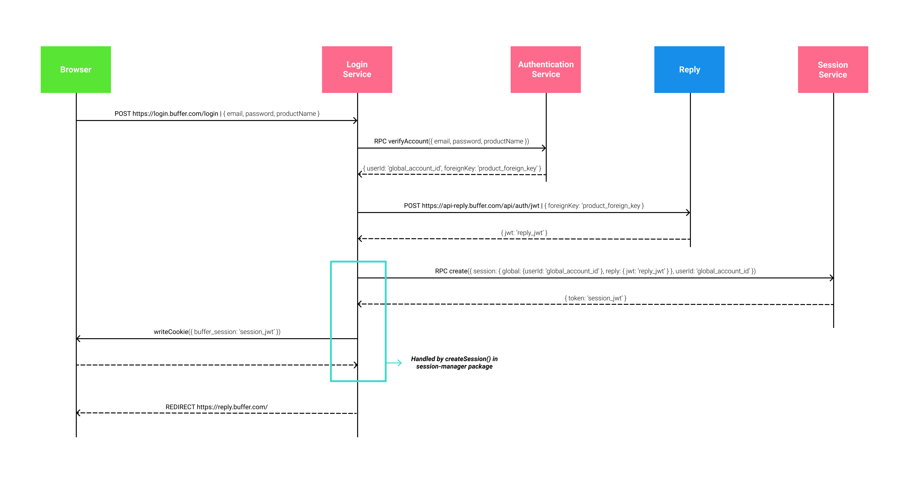
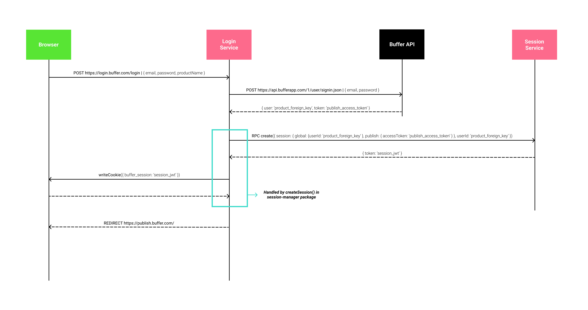
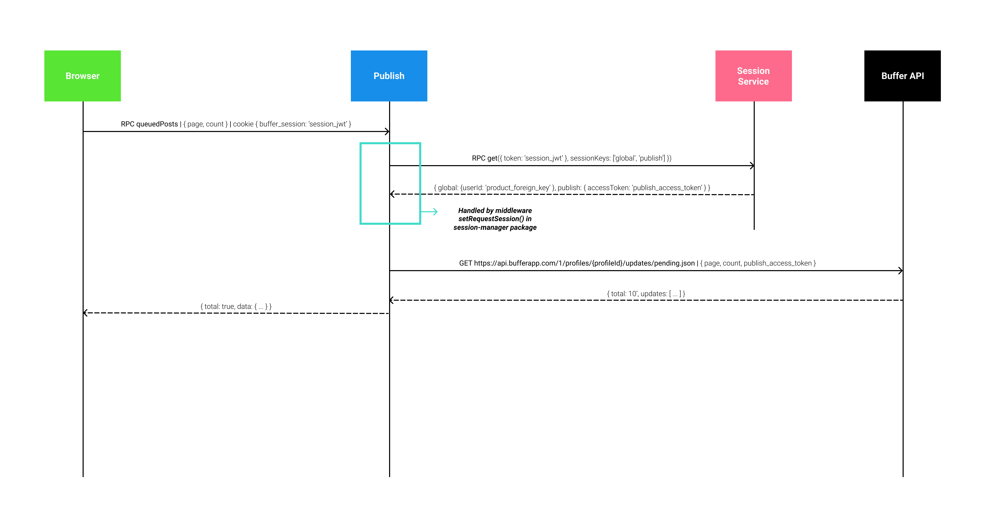

# Account Management Flow Charts

## Login to Reply from Login service

[source](https://www.figma.com/file/cbubx50a6Oz1plcJsw6meVKR/SSO-Flow-Charts?node-id=2%3A0)

## Login to Publish from Login service (current implementation)

[source](https://www.figma.com/file/cbubx50a6Oz1plcJsw6meVKR/SSO-Flow-Charts?node-id=2%3A0)

## Publish request authentication using the Session service (current implementation)

[source](https://www.figma.com/file/cbubx50a6Oz1plcJsw6meVKR/SSO-Flow-Charts?node-id=2%3A0)
